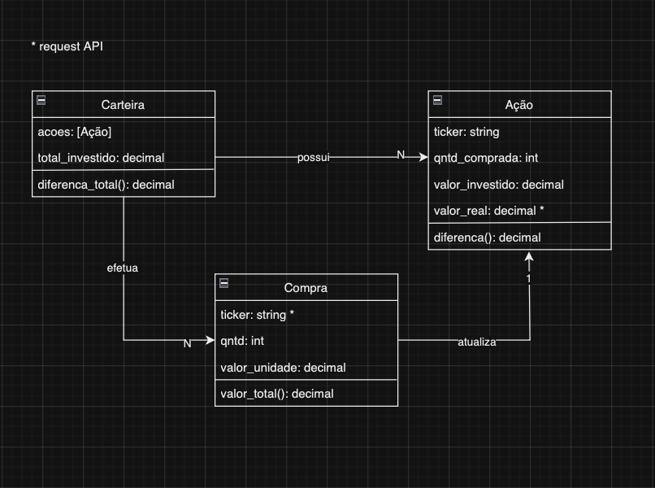
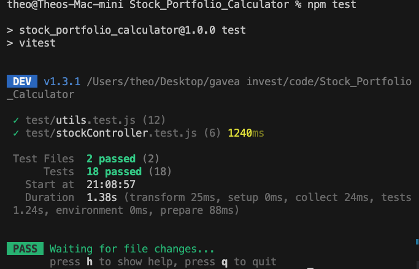
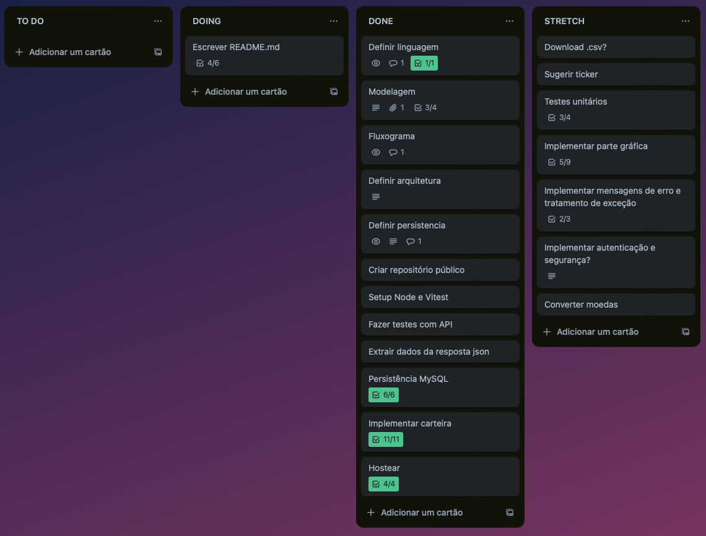

# Stock Calculator
 
<a href="https://stock-portfolio-calculator-2.onrender.com">Stock Calculator</a> é um web app que implementa uma calculadora de carteira de ações, simulando a compra e o acompanhamento de ações.
  
O usuário pode visualizar a carteira, onde para cada ticker (ação) investido, exibe-se a quantidade de ações compradas, o custo da compra, o preço atual, a posição calculada a partir do preço, o lucro (diferença entre posição e custo) e o lucro percentual. Além disso, o programa exibe o custo total e posição acionária (somatórios) de todas as ações. 
  
Se estiver em horário de pregão (entre 9:30 e 18:30) o valor de preço, para cada ticker investido, é atualizado automaticamente. O atraso na atualização dos valores é de no máximo 10 segundos.
  
O usuário pode deletar suas ações ou comprar uma nova. Para a última, informa-se o ticker, a quantidade de ações e um preço unitário (arbitrário). O usuário deve entrar com dados válidos. Depois de exibir o valor final da compra, e confirmando os dados, a carteira é atualizada com as novas ações. 

## Tecnologias

O projeto foi desenvolvido em Node.js/Express e utiliza a REST API da Yahoo Finance para atualizar o valor das ações em tempo real. O banco de dados foi implementado através de MySQL. As páginas html utilizam Bootstrap para componentes visuais customizados.

## Desenvolvimento

O desenvolvimento do projeto começou a partir da modelagem conceitual do problema. 

A partir dela, optei por desenvolver um web app, alvejando construir uma solução completa (frontend + backend) de fácil acesso pelo usuário. Além disso, como eu não tinha conhecimento prévio de Node.js, foi a oportunidade perfeita para meu aprendizado.
  
Após a dificuldade inicial de configurar a estrutura do projeto, implementei o request de ações sem a persistência, produzindo uma suíte de testes unitários para validar a lógica básica do programa.

Após isso, o desafio foi implementar o acesso ao banco de dados de forma RESTful. Por fim, decidi aprimorar a experiência do usuário, modificando o estilo das páginas e adicionando comportamentos de UI personalizados.
  
Em todos os momentos, utilizei a ferramenta online Trello para organizar as sub-tarefas. 

## Próximos Passos

Para construir uma solução ainda mais completa, penso na adição de algumas funcionalidades. 

- Autenticação e criptografia do banco de dados
- Conversão de moedas para tickers estrangeiros
- Download da tabela de carteira para arquivo .csv

## Como acessar

Você pode acessar o web app diretamente pelo link  

https://stock-portfolio-calculator-2.onrender.com

 
As páginas podem demorar para carregar, mediante performance do serviço de hospedagem gratuito.

## Como executar localmente

Alternativamente, você pode clonar este repositório e executar o programa em sua máquina local. Contudo, é preciso ter Node.js e MySQL instalados.
  
Após clonar o repositório, execute os seguintes comandos.

#### Instalar dependências

Para instalar as dependências necessárias, execute
 
<code> npm install </code>

#### Criar banco de dados

Para criar o banco de dados localmente, execute
 
<code> mysql -u root -p </code>
  

Informe sua senha para o usuário root, e através do mysql, execute
 
<code> source src/model/schema.sql </code>
  

Por fim, crie um arquivo .env, com os seguintes campos
 
<code>
MYSQL_HOST='127.0.0.1'
MYSQL_USER='root'
MYSQL_PASSWORD=
MYSQL_DATABASE='stockcalculator'
</code> 
 
onde MYSQL_PASSWORD é sua senha MySQL para o usuário root.

#### Rodar em localhost

Agora, basta executar
 
<code> npm run start </code>
  

O Node.js deve rodar a aplicação em localhost:3000.